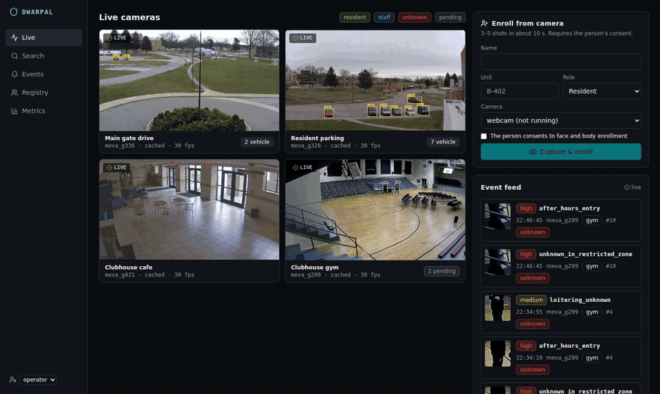
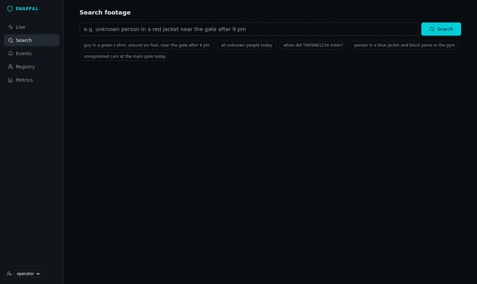
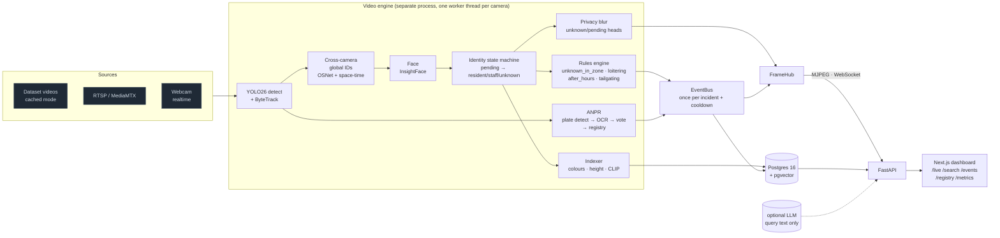

# Dwarpal

AI security operator for gated communities. Dwarpal provides:
- multi-camera person tracking with cross-camera global IDs;
- resident / staff / unknown labelling;
- Indian number-plate recognition;
- real-time alerts and natural-language footage search.

It is built privacy-first: consent-based enrollment, unknown faces blurred everywhere, audited unblur and
automatic deletion of unknown-person data.





> Status: phases **P0–P11 are built**. Some numbers need data or hardware that this build environment could not
> reach: the SmartSpaces download, OSNet weights, your webcam, and a text-labelled Indian plate set.
> [What is waiting on you](#waiting-on-you) lists them. Phase log and every decision:
> [`docs/progress.md`](docs/progress.md). Full spec: [`CLAUDE.md`](CLAUDE.md).

## Architecture



- **Inference never blocks streaming.** The engine runs in its own process. Each camera has a worker thread,
  detection is batched across cameras, and frames reach the API through a queue. The API serves the latest JPEG
  as MJPEG.
- **Cached mode.** Heavy dataset cameras are indexed once (`make index`, or `notebooks/colab_index.ipynb`), then
  replayed at native fps with their cached detections and the same downstream code. The webcam always runs
  realtime.
- **Identity** fuses face evidence (ArcFace) and body evidence (OSNet), weighted by crop quality. A person stays
  `pending` until enough evidence accumulates, so labels don't flicker and there are no false "unknown" alerts.
  Thresholds live in `config/settings.yaml`.

## Quickstart (Windows 11 + WSL2)

Run everything **inside WSL2 (Ubuntu)**, from a clone on the Linux filesystem (`~/Dwarpal`, not `/mnt/c`).

1. Docker Desktop with WSL integration enabled for your distro.
2. Install the tools and the dashboard's Node:

   ```bash
   sudo apt install -y make git ffmpeg nodejs npm
   ```

   Node 20 or newer is required.
3. Install `uv`:

   ```bash
   curl -LsSf https://astral.sh/uv/install.sh | sh
   ```

4. NVIDIA: install the Windows driver only, not a Linux driver inside WSL. Check with `nvidia-smi`.
   The PyPI `torch` wheels target CUDA 13, which needs driver R580+ and a GTX 16xx/RTX GPU. For a GTX 10xx card:

   ```bash
   uv pip install --reinstall torch torchvision --index-url https://download.pytorch.org/whl/cu126
   ```

```bash
make setup           # deps, .env, Postgres+pgvector + MediaMTX, migrations
make data-meva       # MEVA subset (~0.7 GB, public S3; lists sizes first)
make data-smartspaces  # SmartSpaces scene (~1.2 GB; HF_TOKEN if gated)
make index           # one-off: detections (+ Re-ID, faces, plates) for cached cameras
make index-db        # one-off: tracks, colours, CLIP embeddings into Postgres for search
make demo            # API + engine + dashboard → http://localhost:3000/live  (Ctrl-C stops all)
```

**Webcam:** WSL2 can't see USB cameras, so publish yours from Windows:

```powershell
winget install Gyan.FFmpeg
.\scripts\webcam_publish.ps1
```

The backend reads `rtsp://localhost:8554/webcam`. The demo walkthrough is in
[`docs/demo_script.md`](docs/demo_script.md).

Other useful targets:
- `make test` / `make lint`: 200+ backend tests; DB tests skip if Postgres is down.
- `make web-build`: tsc, eslint and `next build`.
- `make eval`: IDF1 plus role / unknown-alert metrics.
- `make enroll-sim`: simulated enrollment on SmartSpaces.
- `make plates-eval PLATES=<dir>`: plate accuracy.
- `make events-replay`: checks that each alert fires once per incident.
- `make gate`: turns your gate clips into ANPR cameras.
- `make streams`: every video as RTSP, playable in VLC.
- `make help`: everything else.

## What it does

| Area | How |
|---|---|
| Detection + tracking | Ultralytics YOLO26 (`yolo26s` default; FP16 on CUDA) + ByteTrack, separately for people and vehicles |
| Cross-camera IDs | OSNet x1.0 (MSMT17) body embeddings, gallery matching, same-camera exclusivity, calibrated same-place and max-speed gating |
| Roles | Gallery of enrolled people (consent required). Face (ArcFace `buffalo_l`) + body evidence feed a state machine: `pending → resident/staff/unknown` |
| Enrollment | Webcam capture (3–5 shots in about 10 s) or photo upload. Simulated enrollment for datasets with a held-out evaluation window |
| ANPR | Plate detector + `fast-plate-ocr` (ONNX), Indian-format normalization (standard + BH series, confusable-character fitting), multi-frame vote, registry: exact = registered, 1 edit = likely registered (verify), else unregistered + alert |
| Attributes | Upper/lower clothing colour (HSV k-means, 11 names, background-filtered legs), height from camera calibration (median ± MAD), CLIP ViT-B/32 embeddings |
| Search | "guy in a green t-shirt, around six foot, near the gate after 9 pm". A rule parser (always on), or an optional LLM (Anthropic structured outputs or any OpenAI-compatible endpoint), produces a strict JSON filter. SQL filters + pgvector CLIP ranking return thumbnails and clips |
| Alerts | `unknown_in_zone`, `loitering`, `after_hours`, `unregistered_vehicle`, `tailgating` (stretch). Zones are polygons per camera. One alert per incident, per-person cooldown, live over WebSocket, audited acknowledgement |
| Privacy | Unknown and pending heads are blurred in streams, thumbnails and clips. Admin unblur is time-limited and audited. Retention deletes unknown-person embeddings, thumbnails and clips after 7 days. Consent is enforced. Only the search text can leave the machine, and only if you configure an LLM |

Config is in `config/`: `settings.yaml` holds every threshold and path; `cameras.yaml` holds sources, zones and
calibration; `rules.yaml` holds alert rules. The LLM is optional:

```
LLM_PROVIDER=anthropic LLM_API_KEY=… [LLM_MODEL=claude-opus-5-5]
LLM_PROVIDER=openai LLM_BASE_URL=… LLM_MODEL=…
```

## Metrics

The dashboard's `/metrics` page reads only reports written by the evaluation scripts. Nothing on it is typed in
by hand. Measured in the build environment (CPU only, MEVA footage):

| Metric | Value | Notes |
|---|---|---|
| Alerts fired more than once per incident | **0** (0 cooldown violations) | `make events-replay`, MEVA gym + cafe, day and night clock |
| Clothing colour, 20-track spot-check | upper 16/19, lower 17/18 | Mostly dark clothing in this clip (see caveat in progress.md) |
| Search top-5 relevance, 6 queries | 18/30 | Rule parser + CLIP ViT-B/32 on small CCTV crops |
| Rule parser on `tests/search_queries.yaml` | 18/18 | `make search-check` |
| Detect + track speed, CPU | 13 fps (`yolo26n`), 8 fps (`yolo26s`) | GPU numbers on your machine |

The headline DoD metrics need inputs this environment could not download: IDF1, role-label accuracy,
unknown-alert precision/recall and exact-plate accuracy. They show as **not measured** until you run the commands
below.

## Waiting on you

| Item | Why it's held | What to do |
|---|---|---|
| SmartSpaces scene + IDF1 / role metrics | Hugging Face is blocked in the build sandbox | `make data-smartspaces && make index && make enroll-sim && make eval` |
| OSNet weights | Google Drive blocked here; the tests used a colour-histogram fallback | Downloaded automatically on first run (`reid.weights_url`) |
| Live webcam enrollment flip (unknown → resident) | Needs your webcam | Follow `docs/demo_script.md` |
| Exact-plate accuracy | Indian-LPR is not public | Put a text-labelled set in `data/raw/plates_eval/<name>/` (`images/` + `labels.csv`), then `make plates-eval PLATES=…` |
| Gate camera with real Indian plates | Needs your clips | Drop them in `data/raw/gate_vehicles/`, then `make gate` |
| LLM query parsing (optional) | Needs an API key | Set `LLM_PROVIDER` / `LLM_API_KEY` in `.env` |

## Layout

```
config/          settings.yaml, cameras.yaml, rules.yaml, mediamtx.yml
backend/app/     api/ core/ db/ datasets/ pipeline/ anpr/ search/ eval/ rules.py events.py privacy.py clips.py zones.py
backend/tests/   pytest (unit + Postgres integration)
frontend/        Next.js dashboard
scripts/         download, adapt, index, evaluate, replay, demo
notebooks/       colab_index.ipynb (indexing on a GPU), train_plate.ipynb (plate OCR/detector fine-tuning)
tests/           search_queries.yaml
docs/            progress.md, demo_script.md, img/
data/            local only (gitignored): raw/ processed/ cache/ thumbs/ clips/ eval/
```

| Service | Port | Purpose |
|---|---|---|
| FastAPI (`make dev` / `make demo`) | 8000 | REST, MJPEG, WebSocket `/ws/events`, OpenAPI at `/docs` |
| Next.js dashboard (`make web` / `make demo`) | 3000 | operator UI |
| Postgres 16 + pgvector | 5432 | tracks, embeddings, plate reads, events, audit log |
| MediaMTX | 8554 RTSP/TCP, 8888 HLS, 9997 API | simulated CCTV cameras and the webcam feed |

## Licensing notes

- **InsightFace pretrained models (`buffalo_l`) are licensed for non-commercial research use only.**
- OSNet weights (deep-person-reid, MIT), Ultralytics YOLO (AGPL-3.0), OpenCLIP LAION weights (MIT),
  fast-plate-ocr / open-image-models (MIT).
- NVIDIA PhysicalAI-SmartSpaces: CC-BY-4.0. MEVA: CC-BY-4.0 (Kitware/IARPA). Both follow their own terms.
- No real people's data is used beyond these datasets and your own webcam and clips.
